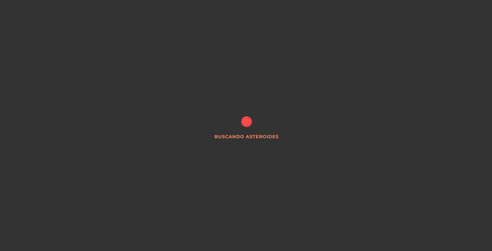
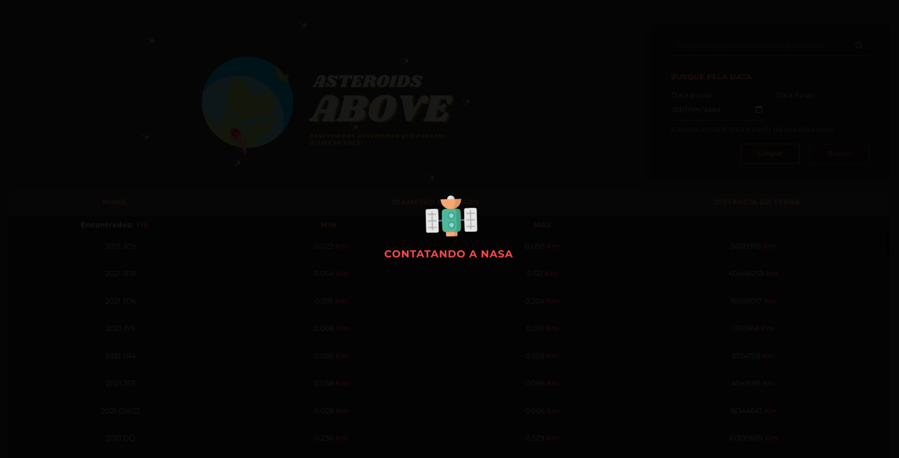

<div>
  <a href="">
    
  </a>
</div>

<h4 align="center">

[Descrição](#desc)  💥 [Tecnologias](#tec)  💥 [Projeto](#projeto)   💥 [Roadmap](#roadmap) 💥 [Rodando localmente](#local)

<br>

</h4>

<br>

<h2 id="desc">
 🌎 Sobre o projeto
</h2>

<p align="justify">
O <strong>Asteroids Above</strong> é uma aplicação web para encontrar asteroides que passaram pela terra a partir de uma data especifica. Alguns deles são perigosos!
<br>

<h2 id="tec">
🛸 Tecnologias
</h2>

<a href="https://reactjs.org">
 
</a>

<a href="https://sass-lang.com/">
  
</a>

<a href="https://reactrouter.com/">
  
</a>

<a href="https://dashboard.heroku.com/login">
  
</a>

<br>

<h2 id="Projeto">
:wrench: Projeto
</h2>
<br>

<a href="">

</a>
<h6 align="center">Clique na imagem para visualizar a aplicação</h6>

<p align="justify">
Essa é a tela inicial do projeto, onde encontramos além dessa apresentação MARAVILINDA, também contamos com uma caixa no canto direito onde é possível filtrar a lista de asteroides pelo nome e por uma data especifica.
</p>
<br>

<div styles="display: flex; align-items: center; justify-content: space-between">
  <a href="">
    
  </a>
  <a href="">
    
  </a>
</div>
<p align="justify">
Aqui vemos as duas telas de carregamento. À esquerda o carregamento inicial quando a primeira chamada à API é feita, e à direita o carregamento de qualquer modificação após a inicialização da aplicação.
</p>

<br>

<h2 id="roadmap">
:world_map: RoadMap
</h2>

<p align="justify">
Para me organizar e concluir o projeto no timing utilizei o <a href="https://www.notion.so"><strong>Notion</strong></a> e você pode conferir qual foi o passo a passo que segui clicando <a href="https://www.notion.so/Roadmap-Ol-s-Tecnologia-643bf13a3b904604aedca7834fb4a687">Aqui!</a>
</p>
<br>

<h2 id="local">
⚛ Rodando aplicação localmente
</h2>

> **⚠ Atenção !** <br> Antes de prosseguir com o passo a passo abaixo você precisa ter instalado em sua máquina o gerenciador de pacote [Yarn](https://classic.yarnpkg.com/en/docs/install) e o [Git](https://git-scm.com).

<br>

> 📝 Clonando o repositório e entrando no diretório criado.

```shell
git clone https://github.com/SaMatheus/olos.tec && cd olos.tec
```

> 📝 Baixando / Instalando dependências.

```shell
yarn install
```

> 📝 Buildando para Produção

```shell
yarn build
```

> 📝 Rodando Aplicação

```shell
yarn start
```

> Pronto 🎉 se tudo ocorreu conforme o esperado 😁 a aplicação estará
> rodando na porta 3000. Basta acessar o endereço no navegador
> http://localhost:3000 e você verá a aplicação funcionando.

<br>

created by [Matheus Sá](https://github.com/SaMatheus)
